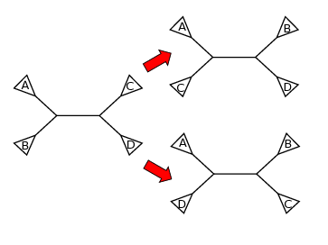

## Distance based methods

## Maximum parsimony

The basic idea behind maximum parsimony (MP) phylogeny inference is that the best phylogenetic tree is the one that explains the character data with the smallest number of
changes.

## Maximum likelihood

## Tree rearrangements

Usually it is not possible to evaluate an optimality criteria like MP or ML for all trees as there are too many:

| Species (rooted) | Species (unrooted) | Number of trees  |
|:---------|:-----------|:-----------------------------:|
| 1        | 2          | 1                             |               
| 2        | 3          | 1                             | 
| 3        | 4          | 3                             | 
| 4        | 5          | 15                            | 
| 5        | 6          | 105                           | 
| 6        | 7          | 945                           | 
| 7        | 8          | 10,395                        | 
| 8        | 9          | 135,135                       | 
| 9        | 10         | 2,027,025                     | 
| 10       | 11         | 34,459,425                    | 
| 11       | 12         | 654,729,075                   | 
| 12       | 13         | 13,749,310,575                | 
| 13       | 14         | 316,234,143,225               | 
| 14       | 15         | 7,905,853,580,625             | 
| 15       | 16         | 213,458,046,676,875           | 
| 16       | 17         | 6,190,283,353,629,375         | 
| 17       | 18         | 191,898,783,962,510,625       | 
| 18       | 19         | 6,332,659,870,762,850,875     | 
| 19       | 20         | 221,643,095,476,699,771,875   | 
| 20       | 21         | 8,200,794,532,637,891,559,375 | 
| 50       | 51         | 2.753 x $10^{76}$             | 

### Nearest neighbor interchange (NNI)

